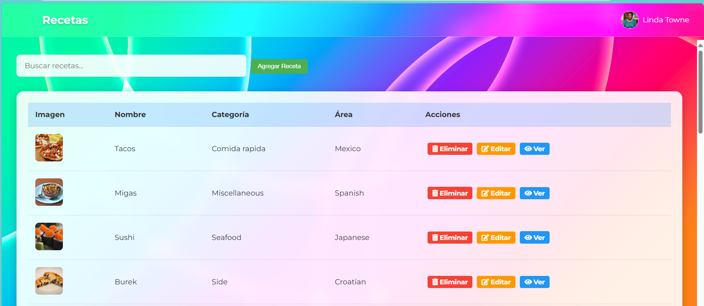

#  RecetaApp - Angular Material - Api

**Integrantes del equipo 5:**
- Fatima Martinez Lopez
- Alary Guzman Jimenez

---

**RecetaApp** es una aplicación web construida con **Angular 20**, **Angular Material** y **RxJS**, enfocada en consultar recetas de cocina. Utiliza la API pública de [TheMealDB](https://www.themealdb.com/) para obtener los datos de las recetas, e implementa autenticación de usuarios simulada usando [MockAPI.io](https://mockapi.io/) y `localStorage` como respaldo.

---

##  Tecnologías usadas

- Angular 20 (`standalone components`)
- Angular Material
- RxJS
- TheMealDB API
- MockAPI.io (mock auth)
- Angular Animations
- LocalStorage
- Jasmine + TestBed
- FontAwesome y Google Fonts

  ---

###  Autenticación de usuarios

La aplicación simula un sistema de autenticación completo con email y contraseña utilizando dos estrategias:

- **Primero intenta autenticarse con la API de MockAPI.io**, una base REST remota.
- Si no hay conexión o falla la autenticación, **cae en un sistema local (mock) usando `localStorage`**, lo cual asegura funcionalidad sin conexión.


---

##  Funcionalidades

###  Autenticación
- Login y registro con email y contraseña
- Persistencia de sesión en `localStorage`
- Fallback a usuarios locales si la API falla
- Soporte para múltiples usuarios con MockAPI

###  Visualización de recetas
- Consulta todas las recetas disponibles
- Búsqueda dinámica por nombre
- Vista detallada de recetas
- Formateo de instrucciones con Pipe personalizado

###  Interfaz y diseño
- Animaciones `fadeInOut`
- Angular Material para diseño responsivo
- Fuentes personalizadas con Montserrat
- Fondo personalizado e íconos de FontAwesome

---

##  Navegación y rutas

La aplicación utiliza el sistema de enrutamiento con `standalone components`. Las rutas están definidas en `app.routes.ts`:

```ts
export const routes: Routes = [
  { path: '', redirectTo: 'auth', pathMatch: 'full' },
  { path: 'auth', component: Auth },
  { path: 'home', component: Home },
  { path: '**', redirectTo: 'auth' }
];
```


## Servicios utilizados

Servicio que maneja toda la autenticación:


```ts
login(email, password)
register(userData)
logout()
getCurrentUser()
isAuthenticated()
initializeMockUsers()

```

---

### RecipesService

Servicio que conecta con la API pública de recetas:

```ts
getRecipes()                 // Obtiene todas las recetas
searchRecipes(term: string) // Busca por nombre

```

---


### Rutas de Navegación

La aplicación define rutas con Angular Router:

```ts
export const routes: Routes = [
  { path: '', redirectTo: 'auth', pathMatch: 'full' },
  { path: 'auth', component: Auth },
  { path: 'home', component: Home },
  { path: '**', redirectTo: 'auth' }
];

```

---

### Animaciones

Archivo animations.ts:

```ts
export const fadeInOut = trigger('fadeInOut', [
  transition(':enter', [
    style({ opacity: 0 }),
    animate('300ms ease-out', style({ opacity: 1 }))
  ]),
  transition(':leave', [
    animate('300ms ease-in', style({ opacity: 0 }))
  ])
]);


```

---

### Estilos

Archivo global styles.css:

```css
body {
  font-family: 'Montserrat', sans-serif;
  background: url('assets/img/img2.jpg') no-repeat center center fixed;
  background-size: cover;
  color: #333;
}

.badge {
  display: inline-block;
  padding: 0.3rem 0.8rem;
  background: rgba(43, 146, 255, 0.2);
  border-radius: 20px;
  color: #2b92ff;
  font-weight: 500;
}


```

---


## Capturas de Pantalla

Capturas de Pantalla
A continuación se muestran las principales vistas de la aplicación:

## Pantalla de Inicio de Sesión


## Pantalla Principal (Home)


## Vista Detallada de Receta

Resultado con Término de Búsqueda


## Eliminacion de una receta


## Edicion de una receta


## Paginacion


## Formulario para creacion de nueva receta





## Demostración en Línea - GitHub Pages

Puedes probar el funcionamiento de la librería directamente aquí:

[Ver demostración en línea](https://fatimamartinezlpz.github.io/usuario_recetas_api/)
